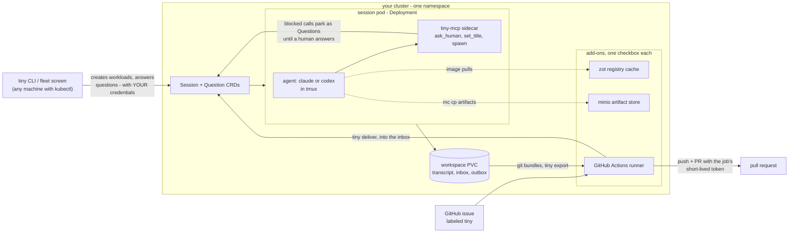

# ◇ tiny

**A coding agent with no keys and no open ports — the real Claude Code and Codex CLIs, as pods on your own Kubernetes.**


An agent that reads issues, pulls dependencies and browses the web is an
agent that will eventually be told to do something by someone who is not
you. The question is what it is holding when that happens.

In tiny it is holding nothing it does not need. No git credentials by
default — work leaves as a `git bundle` that a courier job pushes with a
short-lived token the agent never sees. No cloud credentials, and no route to the metadata endpoint
that would mint some. Nothing listens on the pod, so there is no inbound
surface to attack: you reach a session through the Kubernetes API, not
through a port. When it needs to do something it cannot undo, it asks —
and **your answer runs with your credentials, not its**.

It runs the genuine vendor CLIs, not a copy of them, with a persistent
workspace. Close the lid and a session keeps working, through rate limits
and pod restarts. `tiny handoff` moves a session you are already in —
files, uncommitted changes and transcript — into the cluster.

```
$ tiny new "fix the flaky checkout test, open a PR"
  ◌ session s-x7k2f created on prod/team-a
  ◌ creating workspace and pod
  ◌ pulling images / creating containers
  ● agent up (s-x7k2f-agent)

$ tiny
    NAME        STATE      AGE   CPU    MEM  WHAT
  ✳ s-x7k2f     needs you  12m   84m  512Mi  May I force-push the rebased branch?
  ● api-fix     running     3h  212m  1.1Gi  migrating auth tests to vitest
  └ ● api-db    running    41m  907m  2.9Gi  rewriting migrations in golang:1.26
  ● night-run   running     8h    1m  301Mi  ⏸ Usage limit reached · continuing at 5:20pm
  ✓ readme      done        2d
  · ✉ broadcast to all…
  · ＋ new session
  · ⚙ new session with options…
  · ☰ namespace settings
  · ✕ quit

  [enter] attach  [a] answer  [m] message  [b] broadcast  [d] delete  [n] new  [o] new with options  [q] quit
```

CPU and memory are self-reported by each session from its own cgroup — no
metrics-server, no extra RBAC. WHAT is live: the agent's declared title,
refreshed by its own turns; a session paused on a usage limit says so and
resumes itself.

## The containment, precisely

Security claims are worth what their exceptions are worth, so both halves
are here.

| closed | how |
|---|---|
| repo credentials | none in the pod by default: work leaves as a `git bundle` and a [courier job](https://tinysystems.io/docs/outbox/) pushes it with a short-lived token. Opting into a deploy key (`tiny setup`) puts one there — see the open list |
| cloud credentials | none in the pod, and the egress policy blocks `169.254.169.254`, the endpoint that hands out an instance's IAM role |
| inbound network | nothing listens — no `containerPort`, the MCP sidecar binds `127.0.0.1`. You reach a session through the Kubernetes API, under your RBAC |
| lateral movement | default-deny egress cuts other namespaces, the node, and every port except 80/443 |
| acting as the agent | approving a question runs in *your* client with *your* credentials — which is why the web page is read-only |

| open | why |
|---|---|
| the model credential | it lives in the agent pod. Running the real vendor CLI requires it; this is inherent, not an oversight |
| HTTPS to the internet | by default, yes: a NetworkPolicy matches addresses, not hostnames. The [hostname allow-list](https://tinysystems.io/docs/egress/) narrows it to named hosts — though allow-listing `github.com` still permits a gist |
| the agent's own tool calls | it runs `--permission-mode bypassPermissions`. `ask_human` is cooperative — nothing intercepts it |
| a deploy key, if you add one | `tiny setup` offers to mint one, and the entrypoint copies it to the agent's `~/.ssh`. Convenient for private repos, but it is a long-lived write credential in the pod. The outbox exists so you never have to |

The boundary is the pod, the absent credentials and the network policy —
not a veto over what the agent runs. The third leg of the [lethal
trifecta](https://simonwillison.net/tags/prompt-injection/) is narrowed
by the policy and cut by the allow-list, which routes every outbound
connection through a `CONNECT` proxy that filters by hostname without
terminating TLS.

Full detail: [threat model](https://tinysystems.io/docs/threat-model/) ·
[egress policy](https://tinysystems.io/docs/egress/) ·
[the gate](https://tinysystems.io/docs/gate/)

## What makes it different

- **The agent needs no repo credentials.** It commits locally and drops a
  `git bundle` in `/workspace/outbox/`; a courier job rebases and pushes
  with a `GITHUB_TOKEN` that never enters the agent's pod. With no key in
  the pod a prompt-injected agent cannot push, force-push or reach your
  other repositories — the capability is not there. `tiny setup` can mint
  a deploy key for repos you would rather the agent pushed to directly;
  take it and the agent *does* hold a long-lived write credential, so
  take it deliberately.
- **It's the real CLI, not a wrapper.** Attach and you're in genuine
  Claude Code (or Codex) over a TTY: hotkeys, slash commands, plan mode,
  subagents, skills from your repo, your `.mcp.json` servers. tiny does
  not parse or proxy the agent, so new agent features work without us
  shipping anything.
- **Hand off the session you're already in.** `tiny handoff` from a
  project with a live local Claude Code session ships its working tree
  (dirty files and `.git` included) and transcript into the cluster, and
  the agent picks the conversation up there. Start on the train, finish
  in the cluster.
- **Two agents, one flag.** `tiny new --agent codex` runs OpenAI's Codex
  instead of Claude; `--model` picks the model for either. Sign in with
  the plan you already pay for — Claude Pro/Max or ChatGPT Plus.
- **Sessions survive pod loss.** The workspace is a persistent volume and
  the pod is disposable: a rescheduled pod resumes the transcript and
  keeps going. We test this by force-killing pods mid-task.
- **Any image becomes an agent environment.** `--image golang:1.26`,
  `--image maven:3-eclipse-temurin-21`, or your own dev image: an init
  container injects the agent (claude, codex, a static tmux, the
  entrypoint) into whatever you name. The contract is glibc, git and
  /bin/sh; you don't maintain a special image.
- **Sessions spawn sessions — through a human gate.** A light root session
  plans, then asks to start specialists in the right toolchain with the
  right cpu/memory. You approve each spawn from the fleet screen; children
  render under their parent.
- **Sessions share a namespace, on purpose.** A sandbox exists to keep
  agents away from each other; these can reach each other when you want
  them to. One session drops a file in the artifact store and another
  picks it up, `expose_port` publishes a dev server as a Service so a
  second session can curl it, and an image one session builds is what the
  next one runs. There is no direct message passing between agents —
  coordination goes through artifacts, ports, or a person.
- **A read-only web page, one checkbox.** The `web` add-on serves the
  fleet plus each session's blast radius — files changed, lines, branch,
  and the files two sessions are both editing — at `kubectl port-forward
  svc/tiny-web 8080`. It can only read: approving a question runs with
  *your* credentials, so answering stays in the CLI.
- **A hostname allow-list, not an address one.** Switch on the proxy and
  every outbound connection goes through a `CONNECT` filter that reads
  the hostname before the tunnel opens — no CA in your image, no TLS
  terminated. The internet rule disappears from the policy and DNS
  narrows with it, so the tunnelling channel closes too. Refusals name
  the host and land in `kubectl logs deploy/tiny-egress`.
- **Containment the agent can't opt out of.** The `egress` add-on puts a
  default-deny NetworkPolicy on session pods: this namespace and
  http/https out, nothing else. That closes the cloud metadata endpoint
  at `169.254.169.254` — the documented route to an instance's cloud
  credentials — every port but 80 and 443, and other namespaces. It does
  not stop exfiltration over 443, and it only bites if your CNI enforces
  NetworkPolicy, which the settings screen checks and says out loud.
- **Namespace add-ons, one checkbox each.** A namespace is a group of
  agents — a team, a project, one person. Its settings screen can switch
  on a **zot registry cache** (one Docker Hub pull per image per
  namespace: 191s cold, 9s warm in our tests) and a **minio artifact
  store** (sessions hand each other files with `mc cp build.tar
  store/artifacts/`). Agents can request the store themselves through the
  gate — your y both approves and provisions it. The
  cache is a push target too: a buildah session builds an image, pushes
  it to `$TINY_REGISTRY`, and the next session runs what the last one
  built — build, push, spawn, all inside the namespace.
- **Every decision is an auditable object.** When the agent asks before
  acting, the question parks as a Question CR until a person answers, and
  the answer runs with *their* credentials, not the agent's:

```sh
kubectl get questions
NAME      SESSION   QUESTION                                        ANSWER
q-pr5qp   s-x7k2f   May I force-push the rebased branch?            yes
q-8w6lw   root      …start a session in golang:1.26 (cpu 1) — allow?  allow
```

## How it works

**There is no server and no operator pod.** The namespace runs the
sessions you started and the add-ons you switched on, and nothing else.



Dead pods are replaced by the ReplicaSet, not by anything of ours; the
replacement mounts the same workspace and resumes the transcript.

- A **Session** is a Kubernetes object whose workload is a plain
  Deployment: the agent in a detachable tmux plus a small **tiny-mcp**
  sidecar on localhost — the agent's toolbox (`ask_human`, `set_title`,
  `session_list`, `session_create`, `expose_port`, `enable_store`).
  Kubernetes itself resurrects dead pods — kill one mid-task and the
  replacement resumes the transcript; that is stock ReplicaSet behavior,
  not tiny code.
- Whoever **creates** a session materialises its workload with their own
  credentials — your CLI on `tiny new`, a runner job on `tiny deliver`.
  Deleting the session garbage-collects everything via owner references.
- The sidecar is powerless by design: it can create Questions and update
  its own session's status, nothing else. When the agent reaches a
  decision it must not make alone, the tool call **blocks** — minutes or
  hours — until a person answers. And **answering is acting**: pressing y
  performs the approved action with *your* credentials, so the cluster's
  audit log names the human, not a service account.
- Agents keep a living **title** and turn-by-turn **activity**, so the
  fleet screen says what each session is doing *now*.

## Install

```sh
brew install tiny-systems/tap/tiny     # or a binary from Releases
tiny setup                             # one wizard: cluster, runtime, token, repo key
tiny new "your task"
```

`tiny setup` pins your cluster, installs the runtime (2 CRDs and one
ServiceAccount — no pods), stores your agent credential (`claude setup-token` or an API
key), and mints an ed25519 **deploy key** for private repos — the private
half lives in your cluster, the public half is printed for GitHub. It never
reads your `~/.ssh`.

Re-run `tiny setup` any time: it only offers what's missing, and asks
before replacing an existing token. When a session's credential goes bad,
its fleet row says so in the agent's own words (`Invalid API key`, `OAuth
token has expired`) — replace the token, cycle the session's pod, the
transcript resumes.

## Everyday commands

| command | what |
|---|---|
| `tiny` | the fleet screen — who runs, who needs you |
| `tiny new [task]` | start a session; with no task, attaches you straight to the agent's terminal |
| `tiny new --image golang:1.26 --cpu 2 --memory 4Gi "…"` | session in your toolchain, sized |
| `tiny new --image quay.io/buildah/stable --user 1000 "…"` | a builder — agents build images and push them to the namespace registry |
| `tiny new --agent codex --model gpt-5.2-codex "…"` | the same session, OpenAI's Codex inside |
| `tiny new --dir . "…"` | ship this folder as the workspace — uncommitted changes and `.git` included, no git remote needed |
| `tiny broadcast "demo at 10 — wrap up"` | one message into every unfinished session's inbox |
| `tiny handoff` | move THIS directory's local Claude Code session to the cluster, mid-conversation |
| `tiny attach <session>` | join the session's terminal directly (detach: `ctrl-q d`) |
| `tiny diff [session]` | what a session changed; with no name, the whole fleet plus file collisions |
| `tiny shell <session>` | shell on a session's workspace — finished sessions too |
| `tiny answer <question> <text>` | answer a ✳ card — and perform its action, as you |
| `echo "…" \| tiny deliver <session> --ensure` | pipe a message into a session's inbox (what event sources call) |
| `tiny setup` | interactive setup — and rotation: token, repo key |
| `tiny profile save work` | name a cluster/namespace target; use anywhere with `-p work` |
| `tiny init` | scriptable runtime install for CI (`--context X -n Y --yes`) |
| `tiny upgrade` | update the binary (checksum-verified, never downgrades) |

Every command and flag: **[tinysystems.io/docs/commands](https://tinysystems.io/docs/commands/)**.

On the fleet screen: `m` types a message straight into a session's prompt
(delivered through a durable inbox — it survives pod restarts and
usage-limit pauses), and **dropping a file onto the terminal** — fleet screen
or attached session — streams it to `/workspace/uploads/` with live
progress and hands the agent the path.
With profiles saved, the bare `tiny` start asks which fleet (work, home)
with last-used preselected — enter-enter repeats yesterday's. `--context`,
`-n` and `-p` skip the prompt; scripts never see it.

Attached-session tricks (it's tmux, prefix `ctrl-q` — `ctrl-b` works
too): `ctrl-q d` detach, `ctrl-q c` a plain shell beside the agent,
`ctrl-q ctrl-q` toggle between them, `ctrl-q [` scrollback.

## Label an issue, get a PR

The repo carries a [workflow](.github/workflows/tiny.yml): label an issue
`tiny` and a five-second job on the in-cluster runner (a namespace-settings
add-on) pipes it into the root session's inbox. The session works — spawns
specialists if it needs toolchains — and ships **through the outbox**:

**Agents hold no credentials at all.** To send work out, a session writes
a git bundle to `/workspace/outbox/` — `git bundle create
/workspace/outbox/tiny-issue-7.bundle tiny/issue-7` — and a scheduled
seconds-long courier job (`tiny export`, every ~5 minutes) lifts pending
bundles out over the exec API, rebases them onto `main`, and pushes with
the job's own short-lived token: `tiny/issue-N` becomes a pull request,
a `REPLY.md` on `tiny/reply-N` becomes an issue comment. A bundle is
retired only after its push succeeds. Nothing to paste, nothing stored,
and a compromised agent can neither push nor call the GitHub API.

One-time GitHub setting for the PR half: org **Settings → Actions →
General → Workflow permissions → allow GitHub Actions to create and
approve pull requests**.

## Honest limitations

Things this does not do well yet, so you don't discover them the hard way:

- **Mid-turn work is lost on pod death.** Resume is transcript-level, the
  same as `claude --continue` on your laptop: a replacement pod picks up
  the conversation, not a half-finished tool call. The win is that nobody
  has to be present for it, not that recovery is magic.
- **The model is not self-hosted.** Agents sign in with a Claude or
  ChatGPT subscription and call cloud APIs. That credential lives in the
  agent pod; if your namespace allows egress, an injected agent could
  burn your quota. Scope the account, restrict egress if your CNI can.
- **You need a machine that stays on.** kind on a laptop is fine for
  trying it, but sessions there die with the laptop — the point is a
  cluster that outlives your lid: k3s on an old PC is enough.
- **No background reconcile.** We deleted the operator on purpose, so
  hand-deleted resources stay deleted until some client next touches the
  session. Kubernetes still replaces dead pods; drift beyond that waits
  for a human.
- **Frontend has a friction point.** Code, tests and screenshot
  self-checks work in-cluster (`expose_port` + port-forward for
  previews), but the tight look-and-tweak loop of visual polish is still
  more comfortable on localhost at the end.
- **Claude's usage-limit auto-resume is battle-tested; Codex's isn't
  yet.** The wiring exists for both, but only Claude's has been through
  a real limit for us.
- **Images must be glibc with git for Claude** — alpine works only for
  Codex sessions (its binary is static musl).
- **`tiny handoff` is Claude Code only.** It reads the local Claude Code
  transcript, so a Codex session cannot be moved into the cluster this
  way. Everything after the move works for both.
- **Handoff ships the whole directory.** There is no `.gitignore` filter
  and no exclude list, so `node_modules`, build output and any `.env`
  travel up with the tree. Tidy the directory first if that matters.
- **The agent is not sandboxed from its own tool calls.** It runs with
  `--permission-mode bypassPermissions`, so inside its pod it can execute
  anything; `ask_human` is cooperative, not an interceptor. Containment
  is the pod boundary, the absent credentials, and the egress policy — not
  a veto on what the agent runs.
- **Weeks old.** The pieces above are real and tested, but this is a
  young codebase; read it before pointing it at anything precious. It is
  small on purpose.

## Layout

One repository, one version:

| path | what |
|---|---|
| `cmd/tiny` | the CLI and the fleet screen |
| `cmd/controller` | the tiny-mcp sidecar (its only remaining role) |
| `internal/workload`, `internal/actions`, `internal/addons` | what used to be the manager — run by whoever creates, answers, or toggles |
| `api/`, `config/` | the Session + Question CRDs and the embedded install manifests |
| `images/agent` | the agent image and the injectable payload |

---

> 🌱 Early and building in the open. We're small; stars are the main way
> people find projects like this, so if you want it to keep going,
> **a star up top genuinely helps.**

Website & docs: **[tinysystems.io](https://tinysystems.io)** · field
notes: [tinysystems.io/blog](https://tinysystems.io/blog/) · demo garden:
[seedling](https://github.com/tiny-systems/seedling)

MIT.
